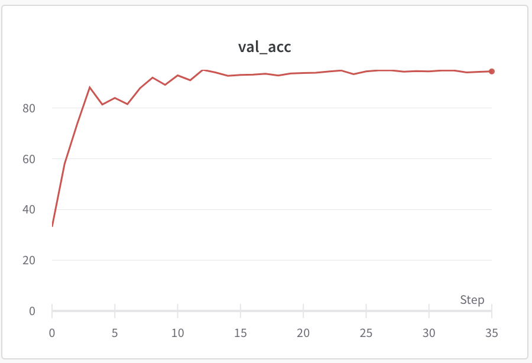

# Vision transformer examples - PyTorch

Based on https://github.com/lucidrains/vit-pytorch

## Dataset
 1. MNIST
 2. Cat and Dog (https://www.kaggle.com/c/dogs-vs-cats/data)

## Install

pip install -r requirements.txt  

## MNIST

Features: Hyper parameter tuning by optuna (https://github.com/optuna/optuna) on MNIST

python vit_mnist.py

## Cat and Dog

python vit_catanddog.py

