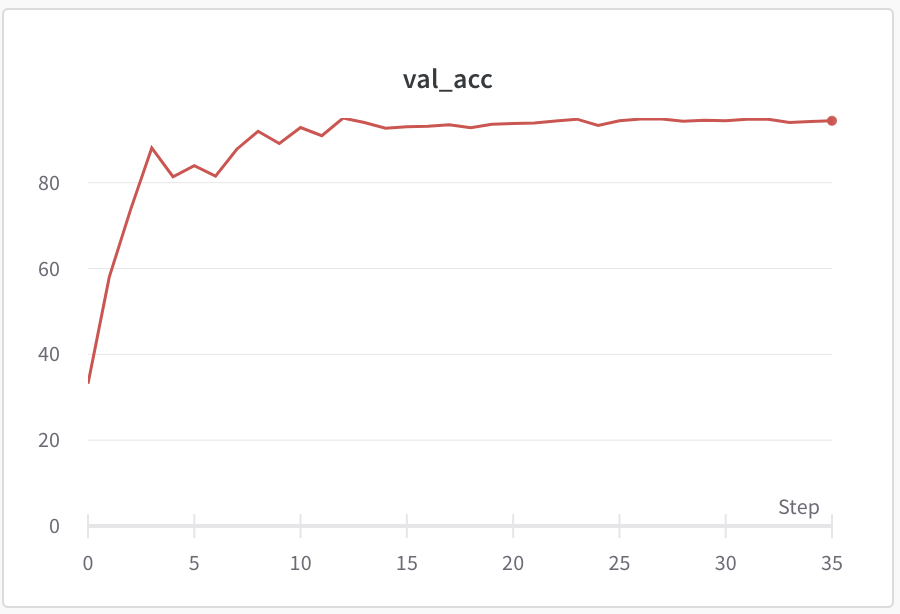
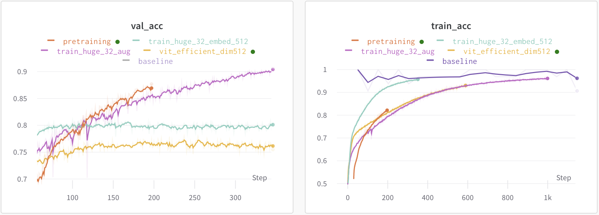

# Vision transformer examples - PyTorch

This repository contains PyTorch examples of Vision transformer (https://arxiv.org/abs/2010.11929). <br>
Code is originally based on https://github.com/lucidrains/vit-pytorch.

## Dataset
 1. MNIST
 2. Dogs vs cats (https://www.kaggle.com/c/dogs-vs-cats/data)

## Install

`pip install -r requirements.txt` <br>


## MNIST

Features: Hyper parameter tuning by optuna (https://github.com/optuna/optuna)

`python vit_mnist.py`




## Dogs and Cats

Download Dogs and cats dataset and unzip into 'data' directory.

`python vit_catanddog.py`

| trial                                | dim | mlp_dim | depth | heads | accuracy |
|--------------------------------------|:---:|:-------:|:-----:|:-----:|:--------:|
| baseline (supervised ResNet50)       |  -  |    -    |   -   |   -   |   98.5%  |
| efficient_dim512                     | 512 |   512   |   16  |   16  |   76.4%  |
| huge32_embed_512                     | 512 |   512   |   32  |   16  |   80.2%  |
| huge32_aug (more about augmentation) | 512 |   512   |   32  |   16  |   93.3%  |
| pretraining (ongoing)                |     |         |       |       |          |

```
import albumentations

train_transforms = albumentations.Compose([
    albumentations.HorizontalFlip(p=0.5),
    albumentations.RandomBrightness(limit=0.2, p=0.75),
    albumentations.RandomContrast(limit=0.2, p=0.75),
    albumentations.OneOf([
        albumentations.MotionBlur(blur_limit=5),
        albumentations.MedianBlur(blur_limit=5),
        albumentations.GaussianBlur(blur_limit=5),
        albumentations.GaussNoise(var_limit=(5.0, 30.0)),
    ], p=0.7),

    albumentations.OneOf([
        albumentations.OpticalDistortion(distort_limit=1.0),
        albumentations.GridDistortion(num_steps=5, distort_limit=1.),
        albumentations.ElasticTransform(alpha=3),
    ], p=0.7),

    albumentations.CLAHE(clip_limit=4.0, p=0.7),
    albumentations.ShiftScaleRotate(shift_limit=0.1, scale_limit=0.1, rotate_limit=15, border_mode=0, p=0.85),
    albumentations.Resize(224, 224),
    albumentations.Cutout(max_h_size=int(224 * 0.375), max_w_size=int(224 * 0.375), num_holes=1, p=0.7),
    
    albumentations.Normalize(mean=(0.5), std=(0.225))
])
```



